# S-Printer — Сервис фотопечати

> Веб-платформа для заказа печатной фотопродукции: фотоальбомы, фотографии, календари.  
> Домен: **s-printer.by**

---

## Содержание

1. [Описание проекта](#описание-проекта)
2. [Бизнес-процессы](#бизнес-процессы)
   - [Регистрация и вход](#регистрация-и-вход)
   - [Заказ с загрузкой фотографий](#заказ-с-загрузкой-фотографий)
   - [Заказ с услугой фотографа](#заказ-с-услугой-фотографа)
   - [Управление заказом администратором](#управление-заказом-администратором)
   - [Жизненный цикл заказа](#жизненный-цикл-заказа)
3. [Техническая архитектура](#техническая-архитектура)
   - [Общая схема системы](#общая-схема-системы)
   - [Стек технологий](#стек-технологий)
4. [Схема базы данных](#схема-базы-данных)
5. [API-документация](#api-документация)
   - [Аутентификация](#аутентификация)
   - [Продукты](#продукты)
   - [Фотографы](#фотографы)
   - [Заказы](#заказы)
   - [Загрузка файлов](#загрузка-файлов)
   - [Административные маршруты](#административные-маршруты)
6. [Процесс загрузки фотографий](#процесс-загрузки-фотографий)
7. [Маршруты фронтенда](#маршруты-фронтенда)
8. [Безопасность](#безопасность)
9. [Запуск и деплой](#запуск-и-деплой)
10. [Структура проекта](#структура-проекта)

---

## Описание проекта

**S-Printer** — это русскоязычная e-commerce платформа для заказа фотопродукции. Пользователи могут:

- Выбрать продукт (фотоальбом, печать фотографий, календарь)
- Настроить параметры (размер, материал, количество страниц и т.д.)
- Загрузить собственные фотографии **или** заказать услугу профессионального фотографа
- Отслеживать историю своих заказов в профиле

Администраторы платформы управляют каталогом продуктов, статусами заказов и видят всех пользователей.

---

## Бизнес-процессы

### Регистрация и вход

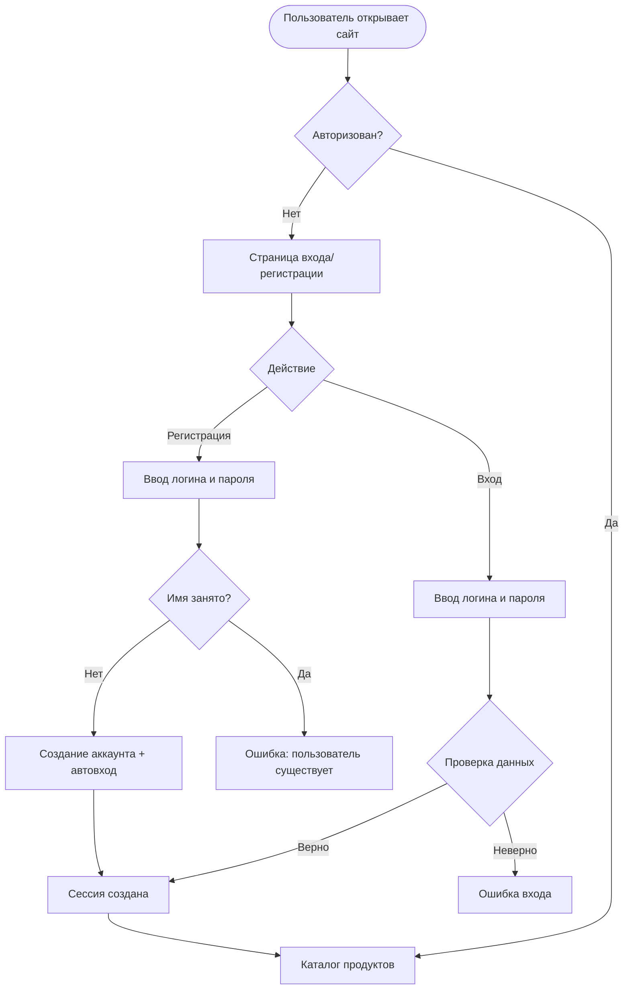

---

### Заказ с загрузкой фотографий

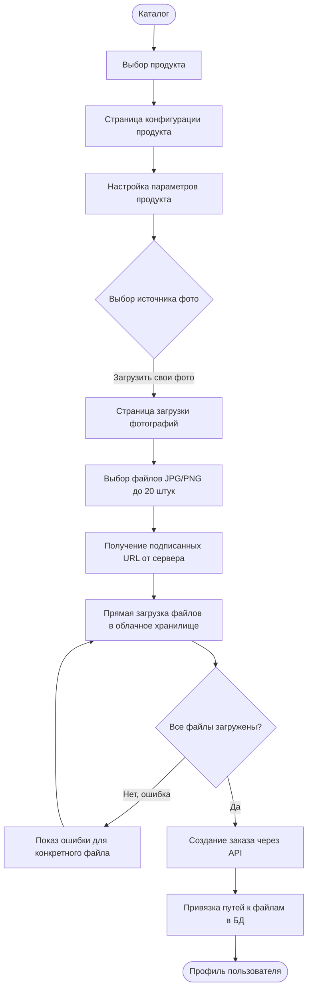

---

### Заказ с услугой фотографа

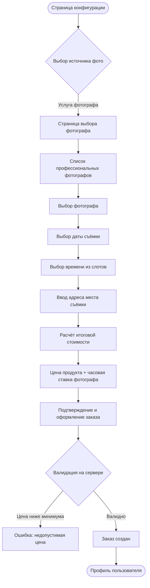

---

### Управление заказом администратором

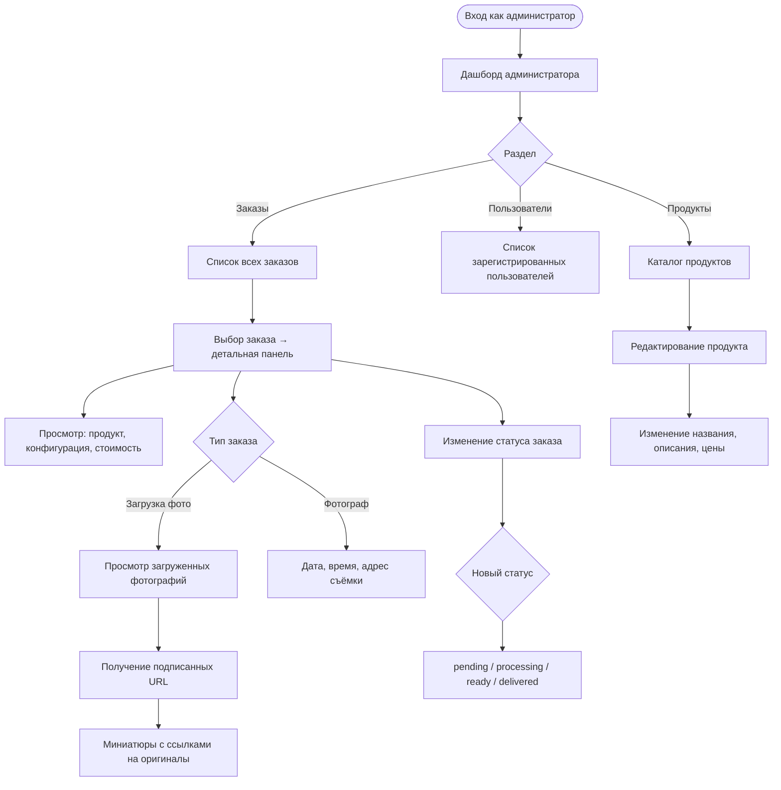

---

### Жизненный цикл заказа

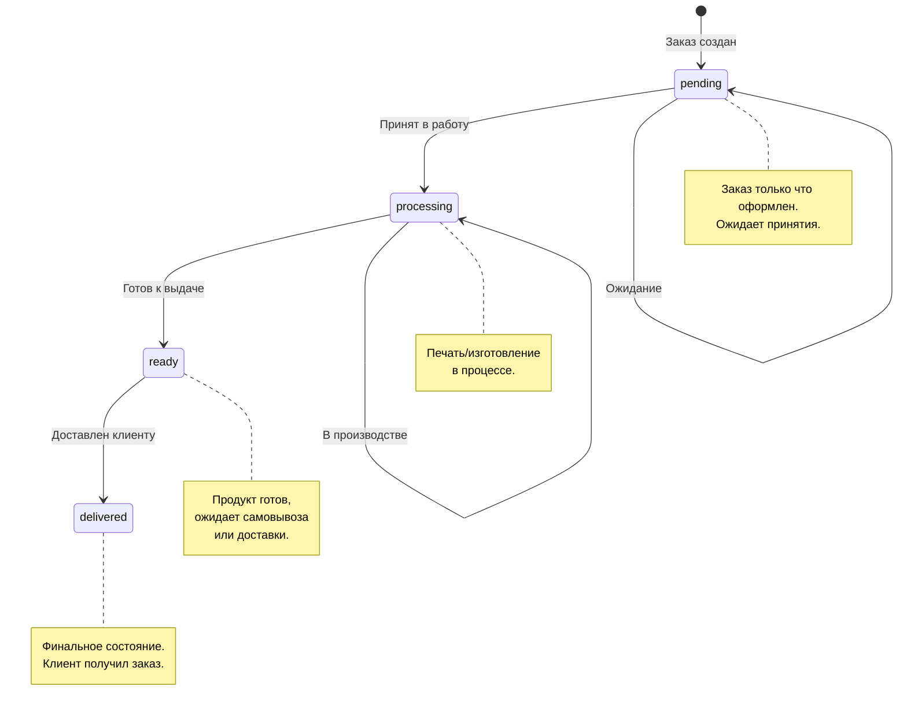

---

## Техническая архитектура

### Общая схема системы

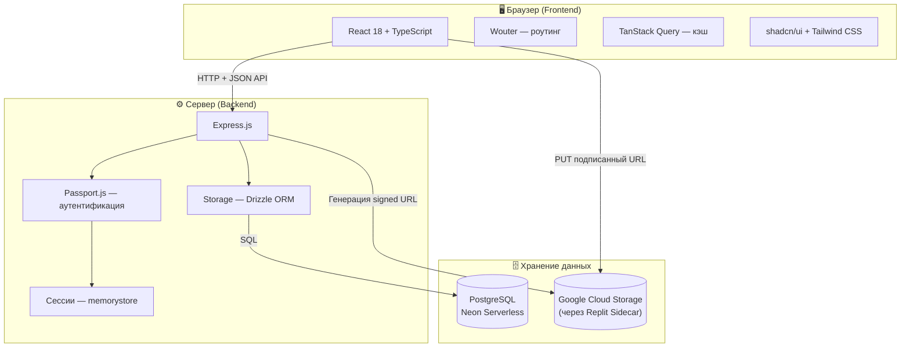

---

### Поток аутентификации сессии

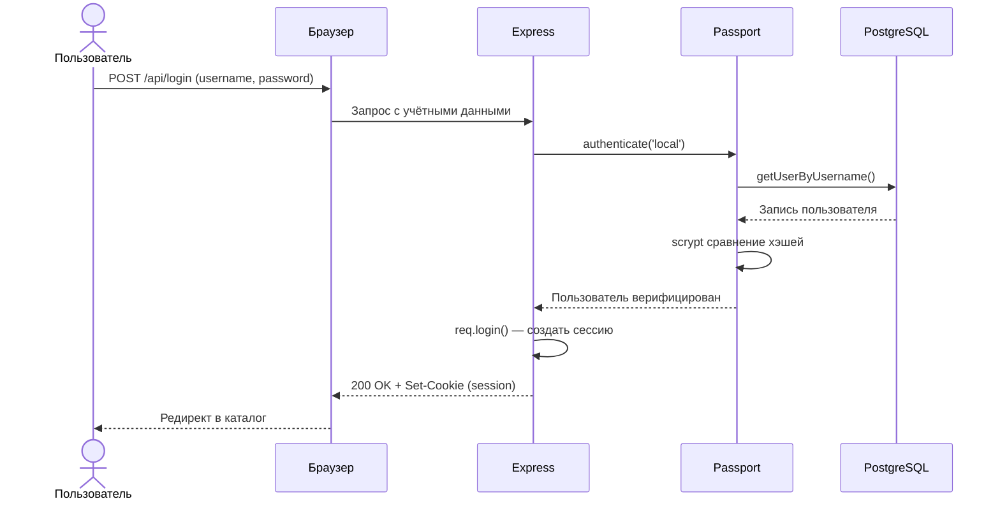

---

### Стек технологий

| Слой | Технология | Назначение |
|------|-----------|------------|
| **Frontend** | React 18 + TypeScript | UI компоненты и бизнес-логика |
| **Роутинг** | Wouter | Клиентская навигация (SPA) |
| **Состояние** | TanStack Query v5 | Серверное состояние, кэш, мутации |
| **UI** | shadcn/ui + Radix UI | Доступные компоненты |
| **Стили** | Tailwind CSS | Утилитарные стили + CSS-переменные |
| **Сборка** | Vite | Разработка и продакшн-сборка |
| **Backend** | Express.js + Node.js | HTTP-сервер, REST API |
| **Auth** | Passport.js (Local) | Аутентификация на основе сессий |
| **Сессии** | express-session + memorystore | Хранение сессий в памяти |
| **ORM** | Drizzle ORM | Типобезопасные SQL-запросы |
| **База данных** | PostgreSQL (Neon) | Основное хранилище данных |
| **Файлы** | Google Cloud Storage | Хранение загруженных фотографий |
| **Валидация** | Zod + drizzle-zod | Схемы валидации данных |
| **Язык** | TypeScript | Полная типизация на клиенте и сервере |

---

## Схема базы данных

### ER-диаграмма

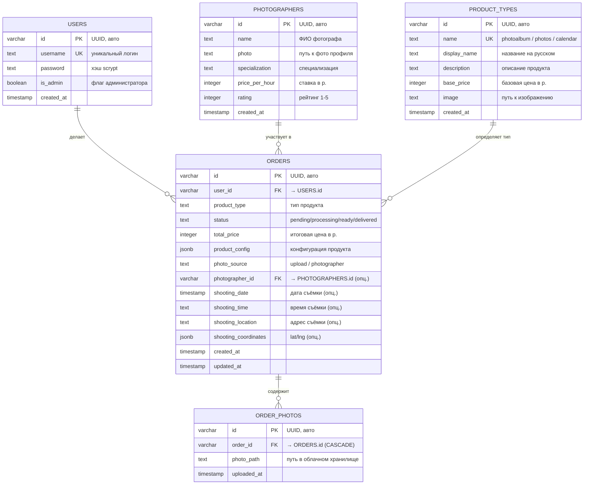

---

### Конфигурации продуктов (JSONB)

В поле `product_config` хранится разная структура в зависимости от типа продукта:

**Фотоальбом (`photoalbum`)**
```json
{
  "size": "small | medium | large",
  "coverType": "soft | hard | premium",
  "pages": 20,
  "paperType": "matte | glossy"
}
```

**Фотографии (`photos`)**
```json
{
  "size": "10x15 | 15x20 | 20x30",
  "quantity": 10,
  "paperType": "matte | glossy",
  "border": false
}
```

**Календарь (`calendar`)**
```json
{
  "type": "wall | desk",
  "size": "A4 | A3",
  "months": 12,
  "binding": "spiral | glued"
}
```

---

## API-документация

Все маршруты API имеют префикс `/api`. Большинство требуют аутентифицированной сессии через cookie.

### Аутентификация

| Метод | URL | Доступ | Описание |
|-------|-----|--------|----------|
| `POST` | `/api/register` | Публичный | Регистрация нового пользователя |
| `POST` | `/api/login` | Публичный | Вход в аккаунт |
| `POST` | `/api/logout` | Аутентифицирован | Выход из аккаунта |
| `GET` | `/api/user` | Аутентифицирован | Текущий пользователь |

**POST `/api/register`** — тело запроса:
```json
{
  "username": "ivan",
  "password": "password123"
}
```

**POST `/api/login`** — тело запроса:
```json
{
  "username": "ivan",
  "password": "password123"
}
```

---

### Продукты

| Метод | URL | Доступ | Описание |
|-------|-----|--------|----------|
| `GET` | `/api/products` | Аутентифицирован | Список всех типов продуктов |
| `PATCH` | `/api/products/:id` | Администратор | Обновление данных продукта |

**PATCH `/api/products/:id`** — тело запроса:
```json
{
  "displayName": "Фотоальбом",
  "description": "Описание продукта",
  "basePrice": 500,
  "image": "/path/to/image.png"
}
```

---

### Фотографы

| Метод | URL | Доступ | Описание |
|-------|-----|--------|----------|
| `GET` | `/api/photographers` | Аутентифицирован | Список всех фотографов |
| `GET` | `/api/photographers/:id` | Аутентифицирован | Данные конкретного фотографа |

---

### Заказы

| Метод | URL | Доступ | Описание |
|-------|-----|--------|----------|
| `GET` | `/api/orders` | Аутентифицирован | Заказы текущего пользователя (с фото) |
| `POST` | `/api/orders` | Аутентифицирован | Создание заказа |
| `GET` | `/api/orders/:id` | Аутентифицирован | Один заказ (с фото) |
| `GET` | `/api/orders/:id/photos/signed` | Аутентифицирован | Подписанные URL для просмотра фото |

**POST `/api/orders`** — тело запроса (загрузка фото):
```json
{
  "productType": "photoalbum",
  "totalPrice": 1500,
  "photoSource": "upload",
  "productConfig": {
    "size": "medium",
    "coverType": "hard",
    "pages": 20,
    "paperType": "glossy"
  },
  "uploadedPhotoPaths": [
    ".private/photos/uuid1.jpg",
    ".private/photos/uuid2.jpg"
  ]
}
```

**POST `/api/orders`** — тело запроса (заказ фотографа):
```json
{
  "productType": "calendar",
  "totalPrice": 2600,
  "photoSource": "photographer",
  "productConfig": {
    "type": "wall",
    "size": "A3",
    "months": 12,
    "binding": "spiral"
  },
  "photographerId": "uuid-фотографа",
  "shootingDate": "2026-05-15T00:00:00.000Z",
  "shootingTime": "14:00",
  "shootingLocation": "ул. Ленина 10, Минск",
  "shootingCoordinates": { "lat": 53.9045, "lng": 27.5615 }
}
```

**GET `/api/orders/:id/photos/signed`** — ответ:
```json
[
  {
    "id": "photo-uuid",
    "signedUrl": "https://storage.googleapis.com/...?X-Goog-Signature=..."
  }
]
```

---

### Загрузка файлов

| Метод | URL | Доступ | Описание |
|-------|-----|--------|----------|
| `POST` | `/api/upload/signed-url` | Аутентифицирован | Генерация подписанного URL для загрузки |

**POST `/api/upload/signed-url`** — тело запроса:
```json
{
  "fileName": "photo.jpg",
  "contentType": "image/jpeg"
}
```

**Ответ:**
```json
{
  "signedUrl": "https://storage.googleapis.com/...?X-Goog-Signature=...",
  "filePath": ".private/photos/uuid.jpg"
}
```

---

### Административные маршруты

| Метод | URL | Доступ | Описание |
|-------|-----|--------|----------|
| `GET` | `/api/admin/users` | Администратор | Список всех пользователей |
| `GET` | `/api/admin/orders` | Администратор | Все заказы (с фотографиями) |
| `PATCH` | `/api/admin/orders/:id/status` | Администратор | Обновление статуса заказа |

**PATCH `/api/admin/orders/:id/status`** — тело запроса:
```json
{
  "status": "processing"
}
```
Допустимые значения: `pending`, `processing`, `ready`, `delivered`.

---

## Процесс загрузки фотографий

Фотографии загружаются напрямую из браузера в облачное хранилище через подписанные URL — сервер не является посредником передачи файлов. Это снижает нагрузку на сервер и ускоряет загрузку.

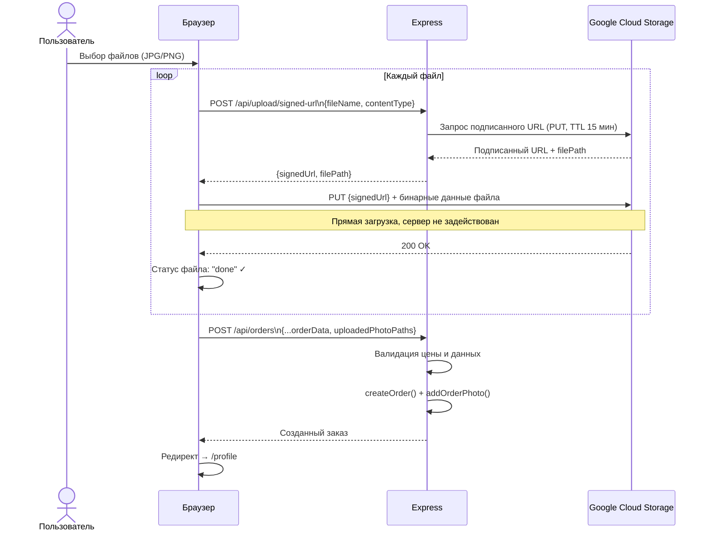

---

## Маршруты фронтенда

| Путь | Компонент | Описание | Защита |
|------|-----------|----------|--------|
| `/` | `home-page.tsx` | Лендинг (редирект авторизованных в `/catalog`) | Публичный |
| `/auth` | `auth-page.tsx` | Форма входа и регистрации | Публичный |
| `/catalog` | `catalog-page.tsx` | Каталог продуктов | Авторизован |
| `/product/:type` | `product-config-page.tsx` | Настройка продукта | Авторизован |
| `/upload` | `upload-photos-page.tsx` | Загрузка фотографий | Авторизован |
| `/photographer` | `photographer-selection-page.tsx` | Выбор фотографа и бронирование | Авторизован |
| `/profile` | `profile-page.tsx` | История заказов пользователя | Авторизован |
| `/admin` | `admin-dashboard-page.tsx` | Панель управления | Администратор |

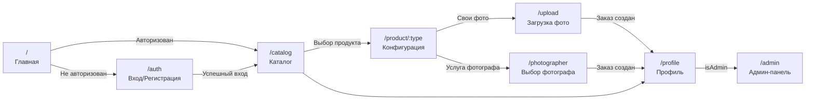

---

## Безопасность

### Аутентификация и авторизация

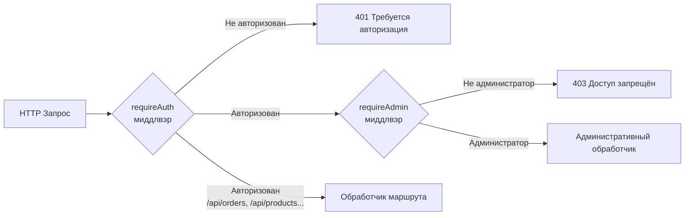

### Применяемые меры безопасности

| Уязвимость | Защита |
|-----------|--------|
| **Хранение паролей** | Хэширование scrypt + соль 16 байт |
| **Сравнение паролей** | `timingSafeEqual` — защита от timing-атак |
| **Cookie сессии** | `httpOnly: true`, `secure: true` в продакшне |
| **Доступ к заказам** | Проверка `order.userId === req.user.id` или `isAdmin` |
| **Подписанные URL** | TTL 15 минут для загрузки, 1 час для просмотра |
| **Валидация цены** | Сервер проверяет цену относительно базовой (нельзя занизить) |
| **Валидация статуса** | Только допустимые enum-значения через Zod |
| **Ответ без пароля** | Пароль никогда не возвращается в ответах API |

---

## Запуск и деплой

### Локальный запуск

```bash
# Установка зависимостей
npm install

# Запуск в режиме разработки (Express + Vite одновременно)
npm run dev
```

Приложение запустится на `http://localhost:5000`.

### Переменные окружения

| Переменная | Описание | Обязательна |
|-----------|----------|-------------|
| `DATABASE_URL` | Строка подключения к PostgreSQL | Да |
| `SESSION_SECRET` | Секрет для подписи сессий | Рекомендуется |
| `DEFAULT_OBJECT_STORAGE_BUCKET_ID` | ID бакета Google Cloud Storage | Да |
| `PRIVATE_OBJECT_DIR` | Директория для приватных файлов | Да |

### Инициализация базы данных

При каждом запуске сервер автоматически выполняет `server/seed.ts`:
- Создаёт пользователя-администратора (`admin` / `admin123`) если его нет
- Создаёт 3 тестовых фотографа если их нет
- Создаёт 3 типа продуктов если их нет

### Данные администратора по умолчанию

```
Логин:  admin
Пароль: admin123
```

> Смените пароль в продакшн-среде!

---

## Структура проекта

```
s-printer/
├── client/                     # Фронтенд (React)
│   └── src/
│       ├── components/
│       │   └── ui/             # shadcn/ui компоненты
│       ├── hooks/
│       │   ├── use-auth.tsx    # Хук аутентификации
│       │   └── use-toast.ts    # Хук уведомлений
│       ├── lib/
│       │   └── queryClient.ts  # TanStack Query + fetcher
│       ├── pages/
│       │   ├── home-page.tsx
│       │   ├── auth-page.tsx
│       │   ├── catalog-page.tsx
│       │   ├── product-config-page.tsx
│       │   ├── upload-photos-page.tsx
│       │   ├── photographer-selection-page.tsx
│       │   ├── profile-page.tsx
│       │   └── admin-dashboard-page.tsx
│       ├── App.tsx             # Роутинг и провайдеры
│       └── index.css           # Глобальные стили + CSS-переменные
│
├── server/                     # Бэкенд (Express)
│   ├── index.ts                # Точка входа
│   ├── auth.ts                 # Passport.js — аутентификация
│   ├── routes.ts               # Все API-маршруты
│   ├── storage.ts              # Слой хранения данных (ORM)
│   ├── db.ts                   # Подключение к PostgreSQL
│   ├── object-storage.ts       # Утилиты для Google Cloud Storage
│   ├── seed.ts                 # Начальные данные БД
│   └── vite.ts                 # Интеграция Vite в Express
│
├── shared/
│   └── schema.ts               # Схемы БД, Zod-валидация, типы TypeScript
│
├── attached_assets/            # Ресурсы бренда
│   └── sprinter-logo.svg       # Логотип S-Printer
│
├── drizzle.config.ts           # Конфигурация Drizzle ORM
├── vite.config.ts              # Конфигурация Vite
├── tailwind.config.ts          # Конфигурация Tailwind CSS
└── tsconfig.json               # Конфигурация TypeScript
```

---

## Цветовая схема и брендинг

| Элемент | Значение |
|---------|----------|
| **Основной цвет** | `#42CC55` (зелёный, HSL 128 58% 43%) |
| **Фон** | Белый / светло-серый |
| **Акцент** | `#42CC55` для кнопок, цен, статусов |
| **Логотип** | `attached_assets/sprinter-logo.svg` |
| **Валюта** | Белорусский рубль (р.) |
| **Язык** | Русский |

---

*Документация актуальна на дату последнего обновления проекта.*
